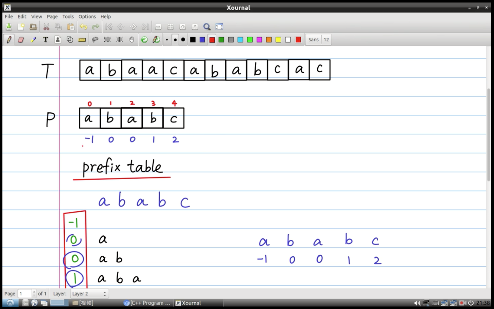
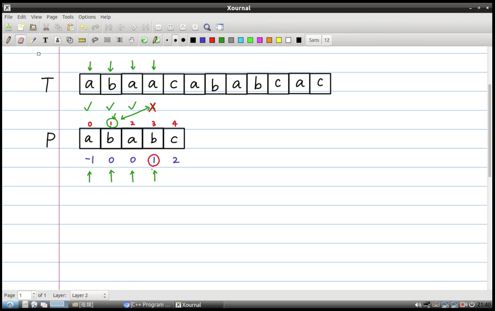
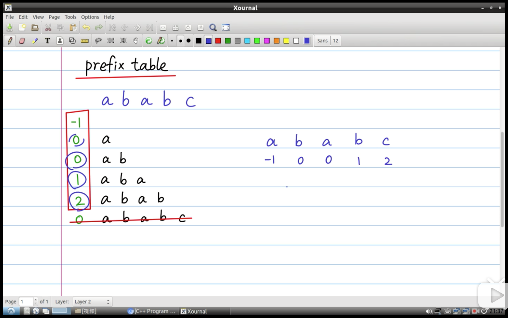

# KMP 字符串匹配

创建要搜索的字符串的前缀表, ababc 的`前缀`为:
* a
* ab
* aba
* abab

再计算每个前缀的`最长公共前后缀的长度`:
* 0: a
* 0: ab
* 1: aba
* 2: abab

则 ababc 的前缀表为: 
`[-1, 0, 0, 1, 2]`
`[ a, b, a, b, c]`
> 第 0 个位置为 -1，其他的按顺序对应给 babc





求前缀表的实现:
```java
import java.util.Arrays;

public class Test {
    public static void main(String[] args) {
        System.out.println(Arrays.toString(calculatePrefixTable("ababc")));
    }

    // 计算 str 的前缀表
    public static int[] calculatePrefixTable(String str) {
        int[] prefixTable = new int[str.length()]; // str 的前缀表
        prefixTable[0] = -1;

        for (int i = 1; i < str.length(); i++) {
            // "ababc" 的前缀有: a, ab, aba, abab
            // 前缀: 1 个字符的子串, 2 个字符的子串, ..., 直到 length() - 1 个字符的子串
            String prefix = str.substring(0, i);
            prefixTable[i] = maxSamePrefixSuffixLength(prefix);
        }

        return prefixTable;
    }

    // 最长公共前后缀的长度: 最前面 n 个字符的子串和最后面 n 个字符的子串相同
    public static int maxSamePrefixSuffixLength(String str) {
        int max = 0;
        int len = str.length();

        // 字符串的最长前缀和后缀，从 len-1 开始递减到 1
        for (int n = len - 1; n >= 1; n--) {
            boolean match = true;

            for (int i = 0, j = len - n; j < len; i++, j++) {
                if (str.charAt(i) != str.charAt(j)) {
                    match = false;
                    break;
                }
            }

            // 第一个匹配的就是最长的，退出
            if (match) {
                max = n;
                break;
            }
        }

        return max;
    }
}
```
