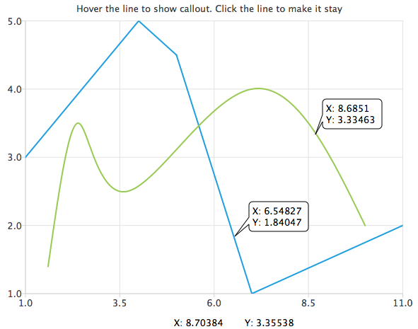

# QChart
最多只有 4 个坐标轴, 但是可以有 N 多条曲线, 所以是曲线 attach axis. Series 的 name 在 legend 上显示.

## Callout
[The callout example](https://doc.qt.io/qt-5/qtcharts-callout-example.html) shows how to draw an additional element (a callout) on top of the chart.

