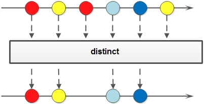

# Stream


创建 Stream:

```java
Stream<String>  stringStream1  = list.stream();
Stream<String>  stringStream2  = Stream.of("taobao");
Stream<Integer> integerStream1 = Stream.of(1, 2, 3, 5);
Stream<Integer> integerStream1 = Stream.iterate(1, item -> item + 1).limit(10);
```

## distict
对于 Stream 中包含的元素进行去重操作 (去重逻辑依赖元素的 equals 方法)，新生成的 Stream 中`没有重复的元素`:


## filter
对于 Stream 中包含的元素使用给定的过滤函数进行过滤操作，新生成的 Stream 只包含`符合条件的元素`:


## map
对于 Stream 中包含的元素使用给定的转换函数进行转换操作，新生成的 Stream 只包含转换后生成的`另一种类型的元素`。这个方法有三个对于原始类型的变种方法，分别是：mapToInt，mapToLong 和 mapToDouble。这三个方法也比较好理解，比如 mapToInt 就是把原始 Stream 转换成一个新的 Stream，这个新生成的 Stream 中的元素都是 int 类型，之所以会有这样三个变种方法，可以免除自动装箱/拆箱的额外消耗:


## flatMap
和 map 类似，不同的是其每个元素转换得到的是 Stream 对象，会把子 Stream 中的元素压缩到父集合中:


```java
public static void main(String[] args) {
    List<List<String>> list = new LinkedList<>();
    list.add(Arrays.asList("One", "Two", "Three"));
    list.add(Arrays.asList("Alice", "Bob", "Carry"));

    // 二层的集合扁平化为一层的集合
    List<String> result = list.stream().flatMap(List::stream).map(String::toUpperCase).collect(Collectors.toList());
    System.out.println(result); // [ONE, TWO, THREE, ALICE, BOB, CARRY]
    
    Arrays.asList("Huang Biao", "Hill Man").stream()
          .flatMap(e -> Arrays.asList(e.split(" ")).stream())
          .collect(Collectors.toList()); // [Huang, Biao, Hill, Man]
}
```

## limit
对一个 Stream 进行`截断`操作，获取其`前 N 个元素`，如果原 Stream 中包含的元素个数小于 N，那就获取其所有的元素:


## skip
返回一个`丢弃原 Stream 的前 N 个元素`后剩下元素组成的新 Stream，如果原 Stream 中包含的元素个数小于 N，那么返回空 Stream:


## peek
生成一个包含原 Stream 的所有元素的新 Stream，同时会提供一个消费函数 (Consumer实例)，新 Stream 每个元素被消费的时候都会执行给定的消费函数:


## reduce
Stream 接口有一些通用的汇聚操作，比如 `reduce()` 和 `collect()`；也有一些特定用途的汇聚操作，比如 `sum()`, `max()` 和 `count()`。注意：`sum()` 方法不是所有的 Stream 对象都有的，只有 IntStream、LongStream 和 DoubleStream 是实例才有。

```java
List<Integer> numsWithoutNull = nums.stream().filter(num -> num != null).collect(Collectors.toList());

List<Integer> ints = Lists.newArrayList(1,2,3,4,5,6,7,8,9,10);
int sum = ints.stream().reduce((sum, item) -> sum + item).get();

int[] nums = new int[]{1, 2, 3, 4, 5, 6, 7, 8};
int min = IntStream.of(nums).min().getAsInt();
```

---

使用 Lambda 的`函数引用`时, 没有或者只有一个参数, 并且只有一条语句的调用:
* 调用参数自己的无参函数: `User::getName`
* 参数作为其他函数的参数: `System.out::println`

```java
import com.alibaba.fastjson.JSON;
import lombok.Getter;
import lombok.Setter;
import lombok.experimental.Accessors;

import java.util.*;
import java.util.stream.Collectors;

@Getter
@Setter
@Accessors(chain = true)
public class Lambda {
    private int id;
    private String name;

    public Lambda(int id, String name) {
        this.id = id;
        this.name = name;
    }

    public static List<Lambda> prepareData() {
        List<Lambda> lms = new LinkedList<>();
        lms.add(new Lambda(1, "Alice"));
        lms.add(new Lambda(1, "Bob"));
        lms.add(new Lambda(1, "John"));
        lms.add(new Lambda(2, "Bob"));
        lms.add(new Lambda(2, "Steven"));
        lms.add(new Lambda(3, "John"));
        lms.add(new Lambda(3, "Loa"));

        return lms;
    }

    /**
     * 介绍 Lambda 的几个常用方法，更多的请参考 JDK 文档 Collectors
     * 只有 sort 会改变原来集合的数据，其他操作不会
     */
    public static void main(String[] args) {
        List<Lambda> lms = prepareData();

        // 1. 只保留 id 大于 2 的元素，过滤掉 id 小于 3 的元素
        lms.stream().filter(e -> e.getId() > 2).forEach(e -> {
            System.out.println(JSON.toJSONString(e));
        });

        // 2. 获取所有不同的名字
        //    返回 List: Collectors.toList()
        //    Collectors.toCollection(Supplier)
        // 2.1 返回 Set，还可以使用 Collectors.toSet()
        // 2.2 也可以使用 distict 返回 List
        Set<String> names = lms.stream().map(Lambda::getName).collect(Collectors.toCollection(TreeSet::new));
        System.out.println(names);

        // 3. 合并为字符串
        System.out.println(names.stream().collect(Collectors.joining(", ")));
        System.out.println(String.join(", ", names));

        // 4. 排序: 先按名字升序排序，名字相同按 id 降序排序
        lms.sort(Comparator.comparing(Lambda::getName).thenComparing(Lambda::getId).reversed());
        System.out.println(JSON.toJSONString(lms));

        // 5. 使用 Map 分组，id 相同的放在一组
        // 6. 遍历 Map
        Map<Integer, List<Lambda>> groupedLms = lms.stream().collect(Collectors.groupingBy(Lambda::getId));
        groupedLms.forEach((id, lms2) -> {
            System.out.println(id + ": " + JSON.toJSONString(lms2));
        });

        // 7. List to Map
        Map<Integer, Lambda> lambdaMap = lms.stream().collect(Collectors.toMap(Lambda::getId, l -> l));
        // 注意: 如果 list 中有 2 个元素的 id 相同，则会报 duplicate key 的错误，解决这个问题可以给 toMap 第 3 个参数指定重复的时候使用哪一个元素
        lms.stream().collect(Collectors.toMap(Lambda::getId, l -> l, (oldValue, newValue) -> newValue));
    }
}
```

```java
public static void main(String[] args) {
    // 1. 去重
    // 2. 逆序
    List<Integer> list = Arrays.asList(5, 2, 2, 3, 4)
            .stream().collect(Collectors.toSet())
            .stream().sorted(Comparator.reverseOrder()).collect(Collectors.toList());
    System.out.println(list); // [5, 4, 3, 2]
}
```
