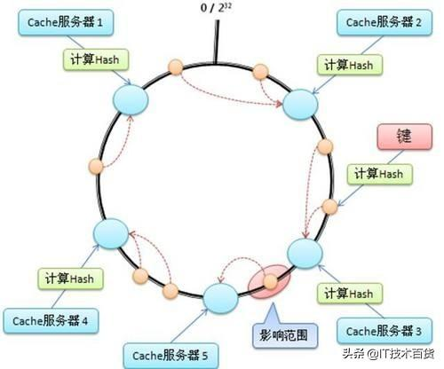

# 一致性 Hash
计算 Hash 值，然后找到比这个值大，并且距离最近的圆环

如上图，假设服务器 2 宕机，那么受影响的将只有服务器 3，而服务器 1、4、5 不会受影响。但这种方式往往会对 3 造成比较大的影响，因此引入虚拟节点，每个真实节点对应一些个不同的虚拟节点；并且每个节点对应虚拟节点是随机的 (实际上并不是随机，而是应当遵循一定的规则)，而不是连续的。这时候如果一台机器宕机，相当于其对应的虚拟节点宕机，由于虚拟节点是随机的，因此会对现存的多个虚拟节点造成影响近似等价于对多个真实节点造成影响，避免只影响一个节点。

假如增加一台机器，只需要从每个机器中抽出一些虚拟节点，分配给这个机器即可，同样不会造成太大影响。

---

助记:
* 普通的 hash 是 n%len 定位相等的数组下标
* 一致性 hash 是 n%len 定位大于这个值且最近的数组下标
* 然后再引入虚拟节点，一个服务对应多个虚拟节点
