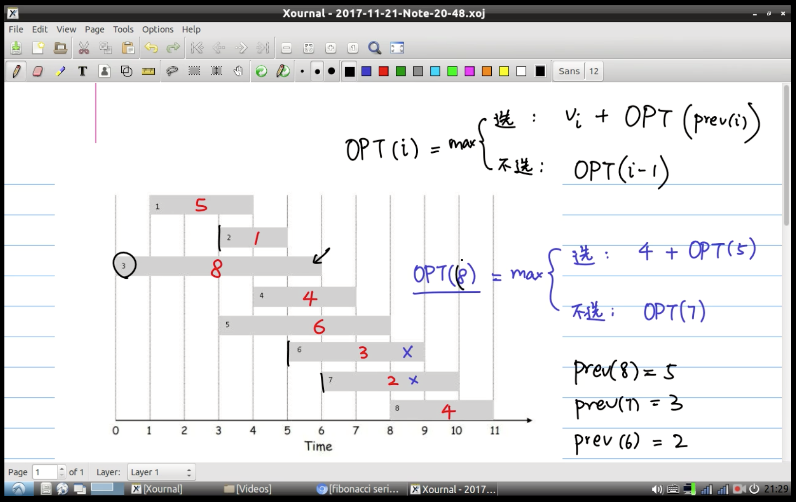
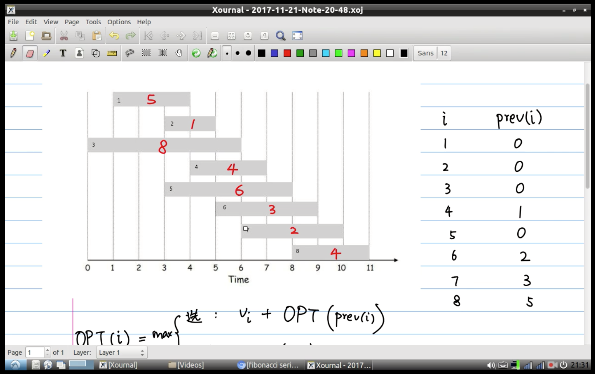
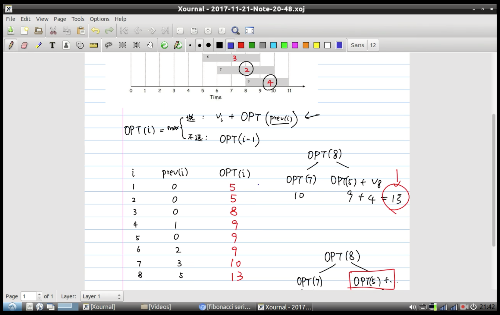
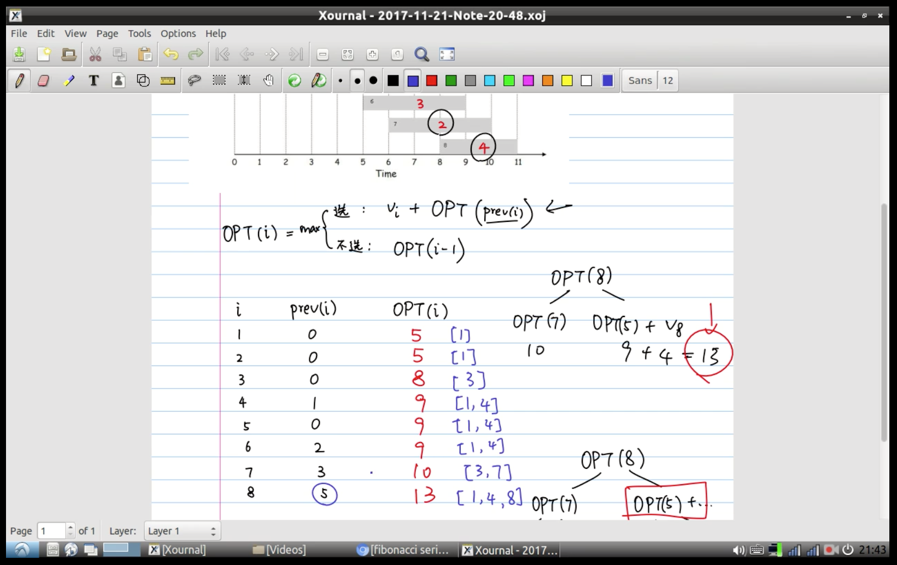
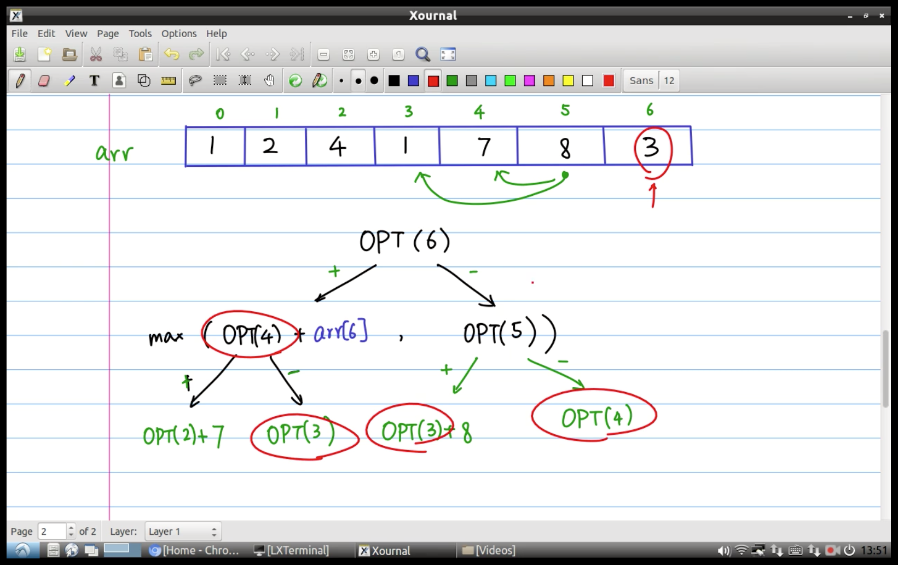
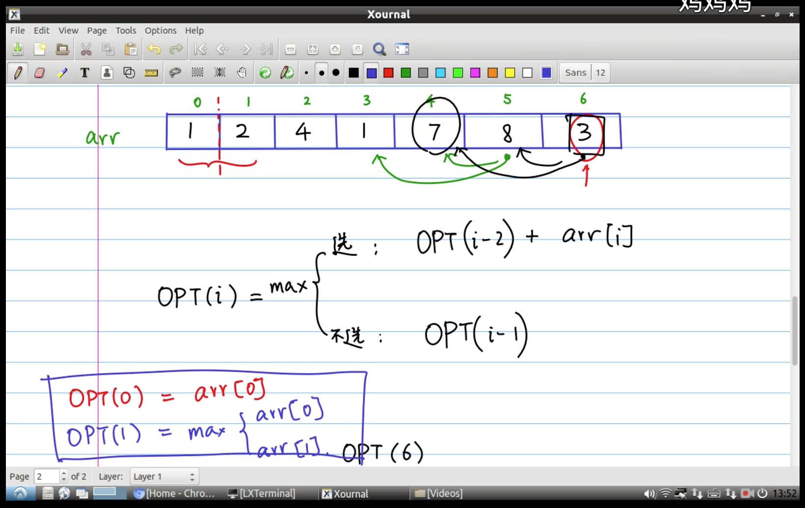

# 动态规划
某个任务，`选与不选`进行求解时，使用[动态规划](https://www.bilibili.com/video/av16544031?from=search&seid=4867047773596344155)求第 i 个问题的最优解 (每个任务都 2 个属性: 代价和报酬)：
* 要做第 i 个任务的报酬: 任务 i 的报酬 + 前一个可做任务的最优解的报酬
* 不做第 i 个任务的报酬: 前一个任务 i-1 的最优解的报酬
* 这 2 种方式的最大报酬则为任务 i 的最优解报酬

求解大问题，可分解为求解多个子问题，子问题重复出现 (Overlap subproblem，也就是递归函数中出现至少 2 个递归语句调用)，可以把子问题的解保存起来，需要时查表使用，避免重复计算，也就是说，从第 1 个问题开始求最优解，一直求到第 N-1 个问题，每个得到的解都保存起来，求第 N 个问题的解时，由他前面问题的解来计算，因为他们已经存储起来了，所以就可以通过查表法得到前面问题的解，最核心的就是下面 2 个函数:
* `pre(i)`: 做第 i 个任务，前一个最近的可做任务 (不冲突的任务，前面可能有多个可做任务，但只选最近的一个)
* `opt(i)`: 做第 i 个任务的最优解

pre[i] 可以在之前预处理出来, 任务从 1 开始，0 的时候得到报酬为 0，关键代码如下:

如果不用查表搜索:
```java
int opt(int i) {
    if(i == 0) return 0;
    return max(opt(i-1), w[i]+opt(pre[i]));
}
```

如果使用查表搜索 (solution 存储每个问题的最优解):
```java
int opt(int i) {
    if(i == 0) return 0;
    if(solution[i] != 0) return solution[i];
    return solution[i] = max(opt(i-1), w[i]+opt(pre[i]));
}
```

或者还可以像背包那样写为 for 一遍过去直接从前往后更新得到。





---
求数组中不相邻元素的最大和:

```java
public class Test {
    private static int[] weight = {1, 2, 4, 1, 7, 8, 3};
    private static int[] solution = new int[weight.length];

    public static void main(String[] args) throws IOException {
        System.out.println(opt(weight.length-1));
    }

    // 方法一
    public static int opt(int n) {
        if (n < 0) { return 0; }
        if (solution[n] != 0) { return solution[n]; }
        return solution[n] = Math.max(opt(n-1), weight[n]+opt(pre(n)));
    }
    
    // 方法二
    public static int opt2(int n) {
        if (n < 0) { return 0; }
        return Math.max(opt2(n-1), weight[n]+opt2(pre(n)));
    }

    public static int pre(int n) {
        return n-2;
    }
}
```

动态规划一般都是使用非递归写法:
```java
public class Test {
    private static int[] weight = {1, 2, 4, 1, 7, 8, 3};
    private static int[] solution = new int[weight.length];

    public static void main(String[] args) throws IOException {
        for (int i = 0; i < solution.length; ++i) {
            solution[i] = Math.max(solution(i-1), weight[i]+solution(pre(i)));
        }

        System.out.println(solution[solution.length-1]);
    }

    public static int solution(int n) {
        return n >= 0 ? solution[n] : 0;
    }

    public static int pre(int n) {
        return n-2;
    }
}
```



