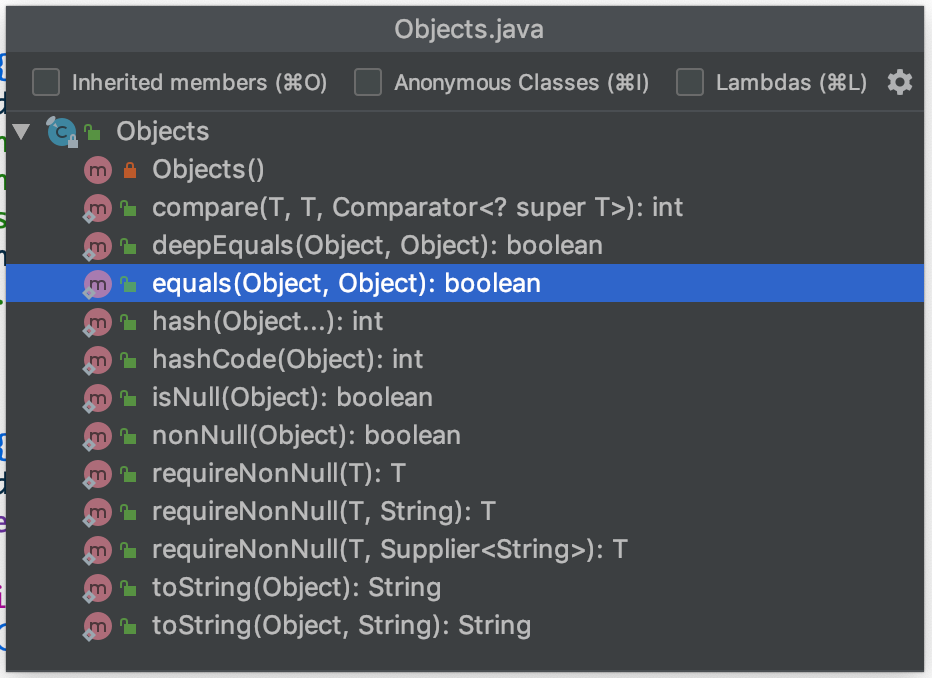
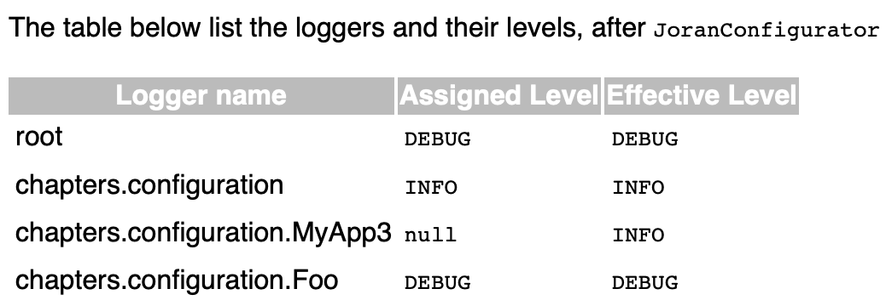
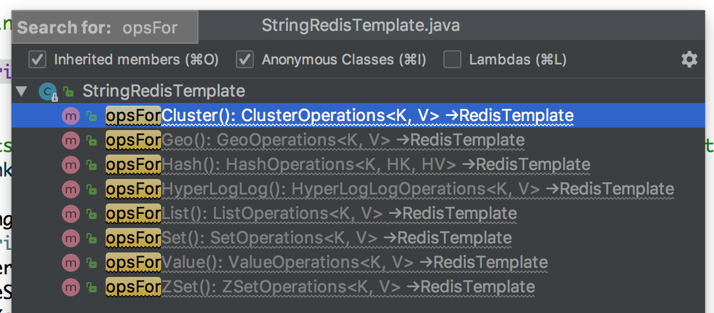

# 常用代码 Java

## 非 null 赋值
```java
this.value = Objects.requireNonNull(value); // 如果 value 为 null 则抛出异常
```

## 使用 Optional 简化空指针判断
[Optional](https://www.toutiao.com/i6649195540640694788/) 类这是 Java 8 新增的一个类，用以解决程序中常见的 NullPointerException 异常问题。

下面为`把用户名转换为大写`的程序:

```java
User user = ...

if (user != null) {
    String userName = user.getUserName();
    if (userName != null) {
        return userName.toUpperCase();
    }
}

return null;
```

使用 Optional 以简化成:
```java
User user = ...;

Optional<User> userOpt = Optional.ofNullable(user);
String name = userOpt.map(User::getUsername).map(String::toUpperCase).orElse(null);
```
关注以下几点:
* `Optional.of(user)` 和 `Optional.ofNullable(user)` 的区别是 user 为 null 时 `of()` 抛空指针异常，`ofNullable()` 不会
* `orElse(defaultValue)`: 如果有值就返回，否则返回一个给定的值作为默认值
* `Optional.isPresent()` 和 `Optional.get()`: 
  * user 等于 null 时 `userOpt.isPresent()` 返回 false，调用 `userOpt.get()` 获取存储的 user 对象时抛出空指针异常
  * user 不为 null 时 `userOpt.isPresent()` 返回 true
* `Optional.map()` 就是 Lambda 的 map，对数据类型进行映射转换，为 null 时不会执行 map 函数，也不会抛出异常

## CyclicBarrier
通过它可以实现让一组线程等待至某个状态之后再`全部同时执行`，叫做回环是因为当所有等待线程都被释放以后，CyclicBarrier 可以被重用。

使用步骤:
1. 创建一个 CyclicBarrier: `b = new CyclicBarrier(5)`
2. 创建并启动 5 个线程
3. 线程中调用 `b.await()`，等待
4. 当 5 个线程中都调用了 `b.await()` 时这 5 个线程一起往下执行
5. 如果前 4 个线程都执行到了 `b.await()`，但第 5 个线程却没有调用 `b.await()`，而是遇到问题，转而去调用了 `b.reset()`, 那么，前面 4 个阻塞在 `await()` 方法上的线程将抛出 BrokenBarrierException 异常

[CyclicBarrier](https://www.toutiao.com/i6640482066855100931) 的内部利用 ReentrantLock 锁和关联的 Condition 条件队列来实现等待和唤醒的, CyclicBarrier 根据一个倒数计数来判断应该阻塞还是唤醒，类似于 CountDownLatch:


> 每个调用 `CyclicBarrier.await()` 的线程继续往下执行，而不是启动线程的线程，如主线程

## CountDownLatch
比如有一个任务 A，它要等待其他 5 个任务执行完毕之后才能执行，此时就可以利用 CountDownLatch 来实现这种功能了:
* A 中调用 `CountDownLatch.await()`
* 其他 4 个线程中调用 `CountDownLatch.countDown()`

使用步骤:
1. 创建一个 CountDownLatch: `c = new CountDownLatch(5)`
2. 创建并启动 5 个线程
3. A 中调用 `c.await()`，等待
4. 当 5 个线程都调用了 `c.countDown()` 后，A 继续往下执行

[CountDownLatch](https://www.jianshu.com/p/205a61af1205) 是通过一个计数器来实现的，计数器的初始值为线程的数量。每当一个线程完成了自己的任务后，计数器的值就会减 1。当计数器值到达 0 时，它表示所有的线程已经完成了任务，然后在`闭锁上等待的线程`就可以恢复执行任务。

> 闭锁线程往下执行，即调用 `CountDownLatch.await()` 的线程，而不是调用 `CountDownLatch.countDown()` 的线程

[CountDownLatch、CyclicBarrier、Semaphore 用法总结](https://segmentfault.com/a/1190000012234469)

## 优先级队列
[优先队列](https://www.toutiao.com/i6635540435437617671/)的作用是能保证每次取出的元素都是队列中权值最小的 (Java 的优先队列每次取最小元素，C++ 的优先队列每次取最大元素), 可以提供 Comparator 定义出队的权重比较, 默认使用小顶堆实现:
* 入队: `offer()`
* 出队: `poll()`
* 队首: `peek()`

```java
public static void main(String[] args) throws IOException {
    PriorityQueue<String> queue = new PriorityQueue<>((a, b) -> b.length() - a.length());
    queue.offer("One");
    queue.offer("Two");
    queue.offer("Three");
    queue.offer("Four");
    queue.offer("A");

    // 能保证每次取出的元素都是队列中权值最小的
    for (String e : queue) {
        System.out.println(e);
    }

    System.out.println("--------------");

    while (!queue.isEmpty()) {
        System.out.println(queue.poll());
    }
}
```

## 解析 HTML
使用 [Jsoup](https://jsoup.org/cookbook/input/parse-document-from-string) 解析 HTML:
```java
String html = "<html><head><title>First parse</title></head><body><p>Parsed HTML into a doc.</p></body></html>";
Document doc = Jsoup.parse(html);
doc.select("p").addClass("chapter");
```
```java
Document doc = Jsoup.connect("http://jsoup.org").get();

Element link = doc.select("a").first();
String relHref = link.attr("href"); // == "/"
String absHref = link.attr("abs:href"); // "http://jsoup.org/"
```

## 使用 try 自动关闭资源
所有实现 java.lang.AutoCloseable 的类都作为资源自动关闭:

```java
try (InputStream in = new FileInputStream("/Users/Biao/Downloads/test.html")) {
    System.out.println(in.available());
}
```

## 关键词提取
[HanLP](https://github.com/hankcs/HanLP) 是一系列模型与算法组成的 NLP 工具包，由大快搜索主导并完全开源，目标是普及自然语言处理在生产环境中的应用。HanLP 具备功能完善、性能高效、架构清晰、语料时新、可自定义的特点。

```java
String content = "内部模块坚持低耦合、模型坚持惰性加载、服务坚持静态提供、词典坚持明文发布，使用非常方便。";
List<String> keywords = HanLP.extractKeyword(content, 10);
System.out.println(keywords); // [坚持, 明文, 发布, 耦合, 模型, 词典, 惰性, 提供, 加载, 服务]
```

## hash code
如果对象的 `equals()` 方法被重写，那么对象的 `hashCode()` 方法也尽量重写:
1. 如果两个对象 equals 相等，那么这两个对象的 hashCode 一定也相同
2. 如果两个对象的 hashCode 相同，两个对象的 equals 不一定相同，只能说明这两个对象在散列存储结构中，存放于同一个位置

HashSet, HashMap 中会使用到 hashCode 和 equals 方法。

## Objects


## Logback


## MyBatis
特殊符号

```xml
<!--查询指定学生历次已批改过考试的成绩，考试名称、班级最高分、班级平均分-->
<select id="findExamAnalysisByUserIdAndSubjectAndRange" resultType="map">
    SELECT r.score, r.rank, e.title, e.highest_score highestScore, e.avg_score avgScore
    FROM  exam_record r INNER JOIN exam e ON r.exam_id = e.id
    WHERE r.user_id = #{studentId} AND e.subject = #{subject} AND r.status = 3
    <if test="startTime != null">
        AND e.start_time >= #{startTime}
    </if>
    <if test="endTime != null">
        AND e.start_time <![CDATA[ < ]]> #{endTime}
    </if>
    ORDER BY e.start_time
</select>
```

## Lombok 创建 log 对象
```java
import lombok.extern.slf4j.Slf4j;

@Slf4j
public class ExamService {
    public void load() {
        log.info("Prepading...");
    }
}
```

## Redis Template


## Misc
* `List<String> list = Arrays.asList("One", "Two")` 得到的 list 的长度不可以改变，也就是说不能添加删除元素，但是可以改变替换已经存在的元素

